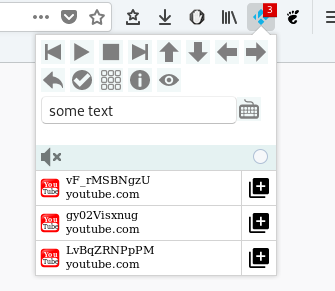

# Kodi-Control 1.0

## About
Firefox Extension to control Kodi remotely. Sending videos, music and pictures to Kodi.

## Features
* Remote control buttons
* Keyboard shortcuts
* History of playable media
* right-click context menu

## Settings
* HOST: IP address of Kodi
* PORT: 8080
* USER: OSMC //example
* PASS: OSMC // not required

## Licence
GPL 3.0
