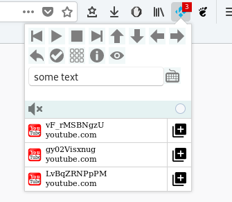
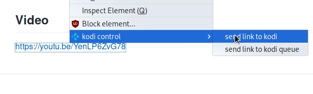

# Kodi-Control

## About
Firefox Extension to control Kodi remotely. Sending videos, music and pictures to Kodi.
Based on Youtube to Kodi by Regss.

## How to use
* set up the settings on the addons page
* start playing a media link in your Browser. The extension will detect the media as soon as it starts playing
* click on the KodiControl Icon in the headerbar
* click on the media in the list on the bottom. KodiControl will send the media link to the connected Kodi device where it starts playing immediately
* alternatively right click on a media link and select "send to kodi"/"send link to kodi"

## Features
* Remote control buttons
* Keyboard navigation (UP, DOWN, LEFT, RIGHT, ENTER, BACKSPACE)
* Mousecontrol, scrolling in menus
* History of playable media
* right-click context menu
* send string to kodi
* send youtube videos to kodi (youtube addon required)
* send vimeo videos to kodi (vimeo addon required)
* send twitch videos to kodi (twitch addon required)
* send images and videos from contextmenu
* send ard, zdf, arte videos to kodi(beta)

## Settings
* IP address of Kodi

## Video
https://youtu.be/KVl9tbku-ZE

## Licence
GPL 3.0
